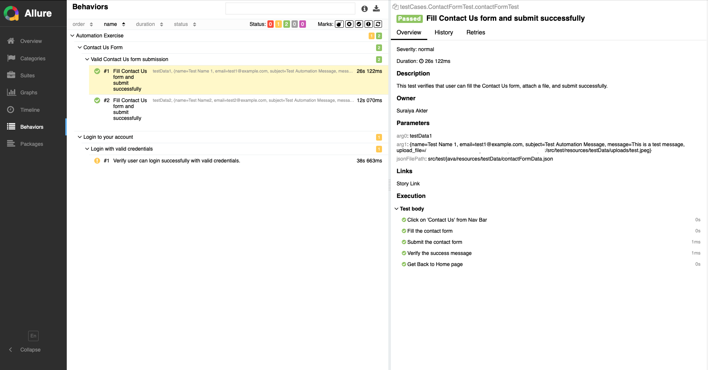

# Automation-Test-Project
A practical automation project that enhances Selenium-based testing with **advanced debugging**, **cookie-powered login reuse**, and a **JSON-driven universal form filler** — helping testers identify failures faster, eliminate login repetition, handle dynamic forms with ease, and keep secrets safe via `.env`.


---


## 📁 Project Overview


This framework automates login functionality on the [Automation Exercise](https://www.automationexercise.com/) site using:

- Selenium WebDriver

- TestNG

- Allure Reporting

- Smart logging with screenshots on failure
- Cookie-based session reuse  
- `.env` support for credentials and secure environment variables
- **Dynamic JSON-based Form Filling** for any form, anywhere


---


## 📦 Install Dependencies


### ✅ Prerequisites

Make sure the following are installed on your system:

- Java 17+

- Maven

- Allure CLI


---


## 🧪 Running the Tests


Run the following command to clean and execute your TestNG suite:

```bash

mvn clean test

```


After execution, you'll find:

- 📸 **Screenshots** in `target/screenshots/`

- 🧾 **Test Logs** in `target/test-output/test-log.txt`

- 📊 **Allure Results** in `target/allure-results/`


To generate the Allure report:

```bash

allure serve target/allure-results

```


---


## 🔍 Key Features


- ✅ Logs success, skip, and failure status of every test method.

- 📸 Captures **screenshots automatically** on test failure.

- 🧾 Stores **clear failure reasons** (e.g., "Element not found") in the log file.

- 🔁 Cookie-based login skip (load cookies if valid, re-login if expired).
- 🔐 Uses `.env` file to load credentials securely.
- 🧹 Auto-clears old logs/screenshots per run.
- 🤖 **One Script to Fill Any Form Anywhere** — powered by JSON + a dynamic `DataProvider`.


---


### 🍪 How Cookie Reuse Works

- ✅ On the **first login**, session cookies are saved into a `cookies.json` file.
- 🔁 On the next run:
  - If cookies are **still valid**, they are **reused** to skip login entirely.
  - If cookies are **expired**, a **fresh login is triggered**, and new cookies are saved.

🧠 We use **Gson** for clean and structured cookie serialization & deserialization.

---
### ⚡ The Ultimate Selenium Hack — Dynamic Form Agent
- Separate methods for each form field become unnecessary.

- All form input data is defined in a simple JSON file as key-value pairs mapping field names to values.

- A universal DataProvider reads this JSON, automatically detects the input types (text, dropdown, file upload, checkbox, etc.), and fills the form accordingly.

- Repetitive, hard-coded scripts are eliminated. Adding a new field requires only updating the JSON — no changes in code are necessary.

- Integrated Allure reports combined with intelligent error handling ensure that any failures are logged clearly, simplifying debugging.

### 💡 The Takeaway
By combining JSON-driven data, a dynamic DataProvider, a universal form filler, and detailed Allure reports, tedious and repetitive form testing transforms into a smooth, adaptive, and highly maintainable automation system.

This is not just automation — it is automation with style.


---

### 🧪 How It All Works Together

Each test runs through a structured lifecycle for maximum clarity and minimal noise:

- 🚀 The browser is launched once at the suite start.
- 📝 Each method logs its status (**pass**, **fail**, **skip**) in `test-log.txt`.
- 📸 On failure, a screenshot is captured, stored, and linked in the Allure report.
- 🤖 For forms, the **JSON-driven dynamic filler** automatically detects and fills the fields.
- ♻️ All screenshots and logs are reset cleanly before every run in the `target/` folder.

This setup makes it easier to:

- Identify bugs faster 🔍  
- Debug test failures with logs + visuals 📋📷  
- Integrate seamlessly into CI/CD pipelines ⚙️  
- Avoid repetitive login steps = faster test cycles ⚡
- Automate any form without extra code changes


---

## ✅ Example Test Scenario

**Automated Login Validation on [Automation Exercise](https://www.automationexercise.com/):**

1. 🧭 Visit the login page  
2. 🔐 Enter valid credentials (loaded securely from `.env`)  
3. 🎯 Validate successful login  
4. 🍪 Save session cookies to `cookies.json`  
5. ⚡ On the next run, reuse cookies to skip login (if still valid)
6. 🤖 If a form is present, auto-fill it using JSON data without touching the code

Only relevant and necessary code is maintained for clarity and readability.


---


## 🔗 References


Read the full articles: 
- [Test Smarter, Not Harder: Detailed Failure Debugging in Selenium](https://qabrains.com/test-smarter-not-harder-detailed-failure-debugging-in-selenium)

- [Cut Login Time, Boost Test Speed: Cookie-Powered QA Automation](https://qabrains.com/cut-login-time-boost-test-speed-cookie-powered-qa-automation)

- [The Ultimate Selenium Hack -- One Script to Fill Any Form, Anywhere]()

---
## Allure Report

The test automation suite generates detailed Allure reports that provide clear insights into test execution, including step-by-step actions, screenshots on failure, and logs.

Below is an example screenshot from the Allure report:


